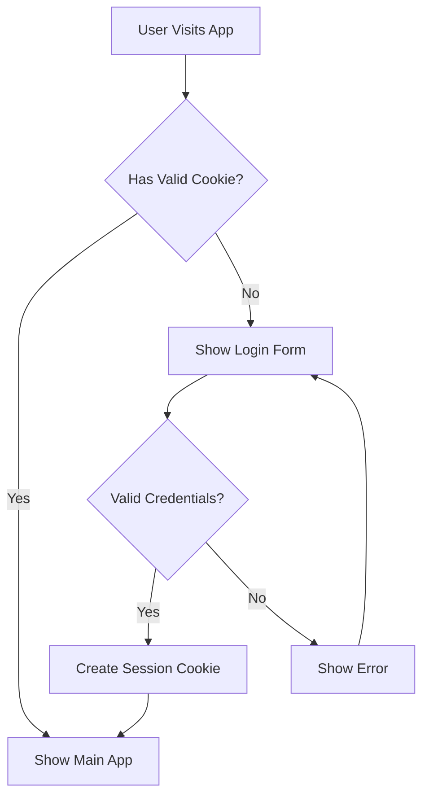

# Authentication Plan

## Overview
Implementation plan for user authentication using streamlit-authenticator package to add secure user access control to the PostgreSQL Query Assistant.

## Configuration Structure

### YAML Configuration
```yaml
credentials:
  usernames:
    jsmith:
      email: jsmith@email.com
      name: John Smith
      password: hashed_password  # Will be hashed using bcrypt
    awhite:
      email: awhite@email.com
      name: Alice White
      password: hashed_password
cookie:
  expiry_days: 30
  key: random_signature_key
  name: authentication_cookie
```

## Authentication Flow


## Implementation Details

### Required Dependencies
```
streamlit-authenticator>=0.2.0
pyyaml>=6.0
bcrypt>=4.0.0
```

### Security Considerations
1. Password Storage:
   - Passwords stored using bcrypt hashing
   - No plaintext storage
   - Salt automatically handled by bcrypt

2. Session Management:
   - Cookie-based session tracking
   - Configurable session expiry
   - Secure cookie settings

3. Environment Variables:
   - Cookie secret key stored in .env
   - Configuration file path in .env
   - No sensitive data in code

### Integration Points

1. Main App Structure:
```python
# Authentication check wrapper
def auth_required(func):
    def wrapper(*args, **kwargs):
        if not st.session_state.authenticated:
            st.error("Please log in to access this feature")
            return False
        return func(*args, **kwargs)
    return wrapper

# Main app flow with authentication
def main():
    # Initialize authentication
    if not st.session_state.authenticated:
        show_login()
    else:
        show_main_app()
```

2. User Context:
- Add user-specific query filtering
- Track query history per user
- Role-based access control potential

## Future Enhancements
1. Role-based access:
   - Admin users for configuration
   - Read-only vs. write access
   - Database-specific permissions

2. Security Features:
   - Failed login attempt tracking
   - Password reset functionality
   - Two-factor authentication option

3. User Management:
   - User registration process
   - Account recovery workflow
   - Profile management
