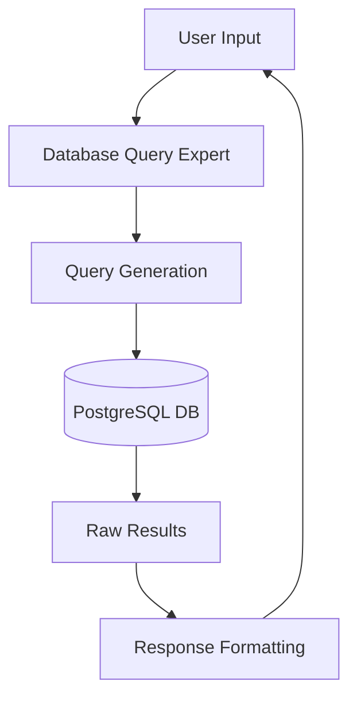

# System Patterns

## Architecture Overview
The system follows a single-agent architecture using CrewAI for task orchestration, with a two-phase query process for handling database interactions.

## Design Patterns

### Agent Pattern
- Single specialized agent acting as Database Query Expert
- No delegation allowed to maintain simplicity
- Consistent role and backstory for reliable query interpretation

### Two-Phase Query Process
1. Query Generation Phase
   - Input: Natural language question
   - Processing: Translation to SQL query
   - Output: Pure SQL query string
   
2. Response Formatting Phase
   - Input: Query results and original question
   - Processing: Context-aware formatting
   - Output: Structured response in one of three formats:
     1. Schema Format: Table structure with columns and data types
     2. Relationship Format: Hierarchical view of table relationships
     3. Data Format: Natural language synthesis of query results

### Database Connection Management
- Connection per query pattern
- Context manager implementation (`with` statements)
- RealDictCursor for JSON-like result access

### Error Handling
- Try-catch wrapping for database operations
- User-friendly error messages
- Clean connection cleanup through context managers

## Component Relationships

## Technical Decisions

### Stateless Operation
- No conversation history storage
- Fresh context for each query
- Reduced complexity and memory usage

### Single File Implementation
- All components in one file
- Clear function separation
- Easy deployment and maintenance

### Environment Configuration
- External configuration via .env
- Sensitive data protection
- Flexible deployment options
