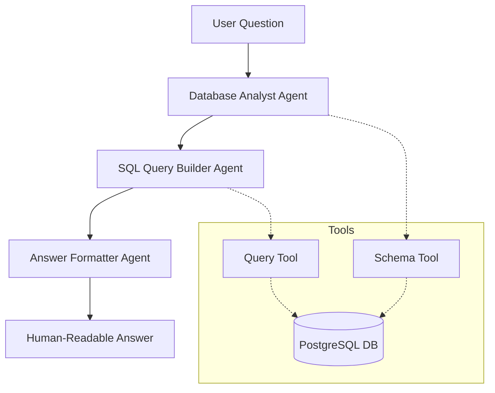

# System Patterns: PostgreSQL Agent

## Architecture Overview

### Multi-Agent System


## Core Components

### 1. Database Connection Layer
- PostgresConnector class handles database interactions
- Connection pooling and management
- Query execution and error handling
- Schema introspection capabilities

### 2. Agent Framework
- Built on CrewAI and LangChain
- LiteLLM model integration
- Sequential task processing
- Inter-agent communication

### 3. Tool System
- LangChain Tool framework integration
- Database-specific tools:
  - execute_sql: Query execution
  - get_schema: Schema inspection

## Design Patterns

### 1. Agent Specialization
- **Database Analyst**: Schema understanding and analysis
- **Query Builder**: SQL generation and optimization
- **Answer Formatter**: Result interpretation and presentation

### 2. Task Pipeline
- Sequential processing flow
- Context passing between tasks
- Lambda functions for dynamic context updates

### 3. Dependency Injection
- Configurable database connection
- Modular LLM integration
- Extensible tool system

## Technical Implementations

### Database Operations
```python
class PostgresConnector:
    # Connection management
    # Query execution
    # Schema introspection
    # Result formatting
```

### Agent Configuration
```python
Agent(
    role="specific_role",
    goal="defined_goal",
    backstory="expertise_context",
    tools=tool_list,
    llm=llm_instance
)
```

### Task Definition
```python
Task(
    description="task_description",
    agent=assigned_agent,
    expected_output="output_specification",
    context=lambda: previous_task.output
)
```

## Integration Points

### External Systems
- PostgreSQL database
- LiteLLM provider
- CrewAI framework
- LangChain tools

### Internal Components
- Connection management
- Query processing
- Result formatting
- Error handling

## Best Practices

### 1. Database Interactions
- Connection string configuration
- Prepared statements for queries
- Error handling and reporting
- Resource cleanup

### 2. Agent Communication
- Structured task handoffs
- Clear context passing
- Error propagation
- Result validation

### 3. System Configuration
- Environment-based settings
- Modular component setup
- Extensible architecture
- Clear dependency management
